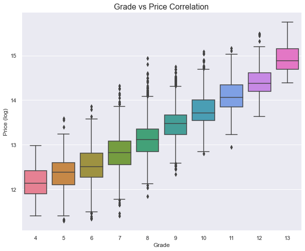
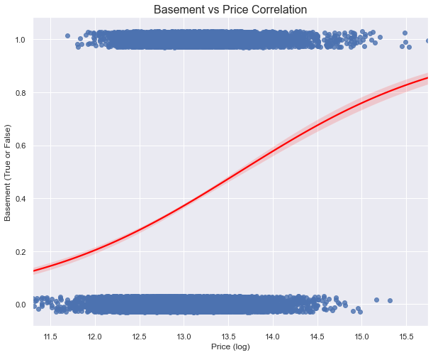
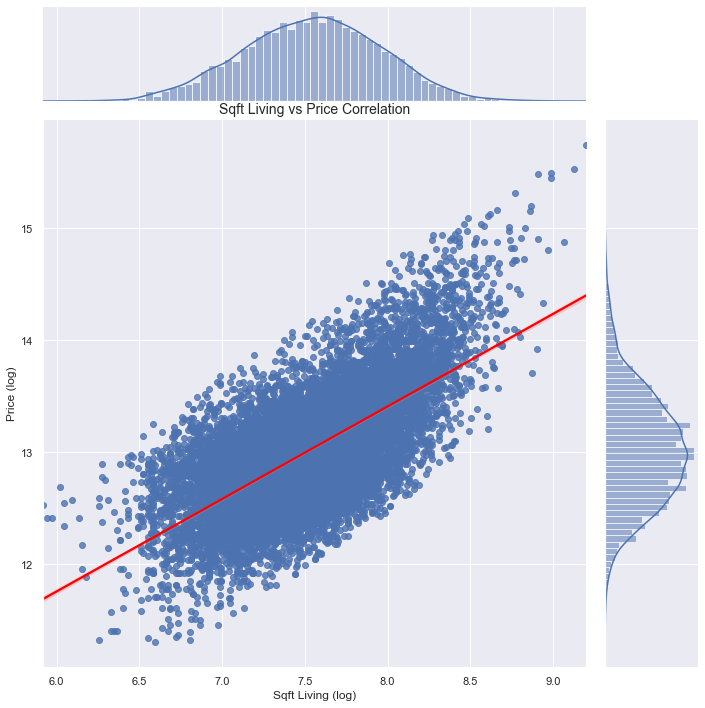

# Housing Price Dependency

Authors: Jocelyn Fisher

## Overview
To provide inference into King County's desired building standards, this project uses an iterative approach to Regression Modelling in order to understand the top 3 architectural features of a house that are correlated with it's selling price. Metricon Homes can not only use this analysis in order to make the most out of their King County Subdivision project, but it may also prove useful if they are afforded similar opportunities across the County or for other Counties within the U.S.

## Business Problem
Metricon Homes has been listed as the top residential building company in Australia for 2020 & 2021. They have been granted a unique opportunity to develop a Subdivision of land within the King County area of Washington State, USA. They will design homes and build one on each lot of the Subdivision. Building in America is completely new territory for an Australian based company. Their departments are unsure if their usual building methods and strategies will suit this North American buying market, and are concerned about losing out on profits for the houses they intend to construct.

Before construction begins, they wish to see what architectural features of a home within King County may effect the price of the houses they intend to build and sell. It is up to this project to delve into the historical housing data of the area and show the top 3 variables that are most correlated with the price of the house, and provide distinct estimates on how much it increases the value of the properties. This will enable Metricon Homes to have a unique understanding of what may determine house prices within this entirely new region. The business may also use the model on other County's data if they are afforded more projects within the States.

## The Data
The data provided for this project includes the selling price and characteristics of homes that were sold in King County during 2014 and 2015. In it's original state, it has over 21,597 entries, each with a wide variety of information on the house. Not only did it provide insight into it's construction and architectural features; such as number of floors, bedrooms and bathrooms, but also many columns on it's location as well, including whether it was a waterfront property, it's zip-code, and the latitude and longitude.
The data-frames used can be found in the [data folder](data/kc_house_data.csv) of this repository.

## Method
This project used an iterative approach to regression modelling to provide an insightful overview of the architectural aspects of a house in order to indetify the top 3 features that are correlated with the selling price of the property.

Through various visualisations and Linear Regression Analysis from a simple base model, the project went through five total iterations. These versions tackled issues such as identifying categorical data, dropping variables that showed high correlation (multicollinearity) to others, and transforming data to tackle skewness showcased in both the dependent and independent variables.

## Results
Out of all the architectural variables in play, the regression analysis determined that the top 3 that were most highly correlated with the house selling price were:

### 1) Grade


It is observable that the better construction materials, and more complex/well-planned architecture of the house, the higher the price the house will sell for. Some of the key attributes for these higher grades include:

- Quality design seen in the floor plans
- Higher quality finish work on interior and exterior
- Added amenities including solid woods, bathroom fixtures
- All materials are of the highest quality

Further Linear Regression analysis revealed that approximately for every grade level attained, the house price will increase by roughly $ 104,000 USD.

### 2) Basement


If the house is built with a basement, the house price will approximately increase by roughly $ 61,000 USD.

### 3) Sqft Living Space


Approximately for every 1 sqft of living space added, the house price will increase by $ 165 USD.

## Conclusions
Based off these regression analysis results, Metricon Homes should ensure the following to maximise the selling price of the houses they intend to construct:  
- **The houses should have high quality architectrual designs, with high calibre materials, finish and ammenities, to ensure the home is granted a high `grade` by the King County Council.** Evidently, people in the King County will pay more for a well built and well constructed home.  
- **The houses should be built with a basement.**  This is a very important note, as Australian homes are rarely built with a basement. However, it is obviously an extremely important factor when purchasing a house in the U.S. most likely due the common nature of Tornado weather systems.  
- **The houses should have a large square footage of living space.**  

### Next Steps
Further analysis could produce supplementary understanding of what is correlated with house pricing:  
- **Analysis of location data can be utilised to find which areas to build in**. This particular data set had very incomplete/skewed data when it came to the zip-code. Either more regression modelling can look at it's possible polynomial relationship to price, or using further external data sources could provide useful information on which areas of King County are correlated with selling prices.
- **Investigate Median Income trends**. There has been previous industry research that concluded the Median Income for an area can determine the house selling prices. When coupled with the above modelling, this data may have a more sophisticated understanding of where houses might sell for a higher price.
- **Gather housing data on other potential Counties**. If Metricon Homes is presented with similar Subdivision projects, this regression model may be used on other Counties housing data within the U.S to see if the have differing ideas of what is correlated with house price.

## For More Information
Please review our full analysis in the notebooks found in the [Code Folder](Code/) and the Kingn County Housing Presentation pdf.

For any additional questions, please contact **Jocelyn Fisher** at **[jocelynclaire216@gmail.com](mailto:jocelynclaire216@gmail.com)**

## Repository Structure
```
├── Code
│   ├── Data Cleaning & Exploration.ipynb
│   └── Regression Modelling.ipynb
├── data
├── Images
├── King County Housing Analysis.ipynb
├── King County Housing Presentation.pdf
└── README.md
```